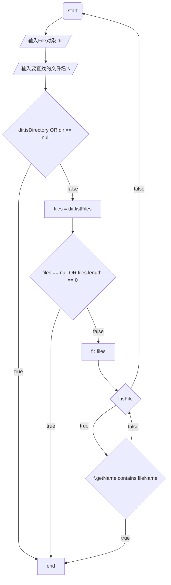
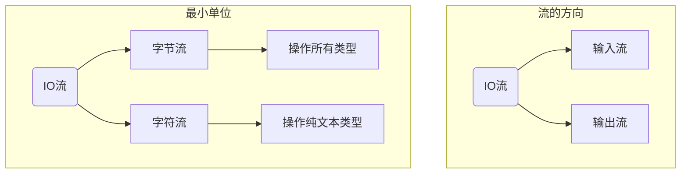
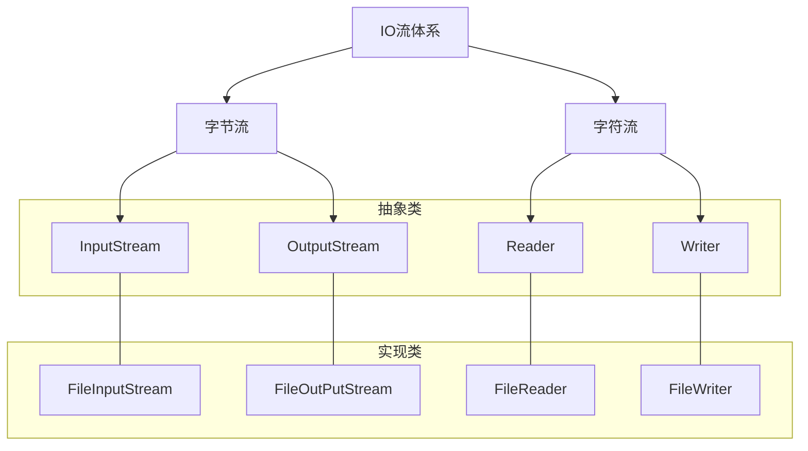

# File

该类创造的对象用来指代当前系统的文件对象（文件、文件夹）。

创造一个File对象：
```java
// 使用 绝对 路径创造 文件 对象
File f = new File("/Users/jam/Document/jam.txt");
// 使用 相对 路径创造 文件 对象
// 该相对路径是相对于工程文件下
File f2 = new File("day9/src/data.txt");
// 使用绝对或相对路径 创造 文件夹 对象
File f3 = new File("/Users/jam/Documents");
File f4 = new File("day9/src");        
```

## API

```java
// 检验是否是文件夹，是返回true
public boolean isDirectory()
// 检验是否是文件，是返回true
public boolean isFile()
// 检验是否存在，是返回true
public boolean exists()
// 返回绝对路径
public String getAbsolutePath()
// 返回定义时的路径
public String getPath()
// 返回文件（夹）名称
public String getName()
// 返回文件最后被修改的时间毫秒值
public long lastModified()
```

```java
// 创建新文件 
public boolean createNewFile()
// 创建单级文件夹
public boolean mkdir()
// 可创建多级文件夹
public boolean mkdirs()
// 删除此路径的文件或 空。文件夹
public boolean delete()
```

```java
// 返回当前目录下所有的“一级文件名称”到一个String[] 
public String[] list()
// 返回当前目录下所有的“一级文件 ‘对象’ ”到一个File[]
public File[] listFiles()
```

### 方法递归

直接调用自己或间接调用自己的形式被称为**方法递归（recursion）**。

如果没处理好递归形式可能会出现`StackOverFlowerException`。

有什么用？

#### 文件搜索

- 当File对象所指文件或文件夹不存在时，`listFiles()`返回`null`；
- 当File对象是一个文件时，返回null；
- 当File对象是一个空文件夹时，返回一个长度为0的数组；
- 当File对象是一个有内容的文件夹时，将该文件夹的所有文件于文件夹的路径放入File数组中返回
- 当File对象是一个有隐藏文件的文件夹时，将里边所有文件和文件夹的路径放入File数组中返回，包含隐藏内容。

根据这几个规定，我们可以设置这样一种算法用来遍历某一文件夹内的有所文件与文件夹：



```java
public static void searchFile(File dir, String fileName) {
  // 检验传入的File对象是否指向文件或空文件夹
  if (!dir.isDirectory() || dir == null) {
    System.out.println("您所搜索的dir并非为文件夹");
    return;
  }
  // 遍历一级文件对象
  File[] files = dir.listFiles();
  // 检验该文件夹下是否存在文件对象
  if (files == null || files.length == 0) {
    return;
	}
  for (File f :
      files) {
    // 如果有文件，匹配文件名
    if (f.isFile()) {
      // 如果匹配成功，则输出文件的绝对路径 return;
      if (f.getName().contains(fileName)) {
        System.out.println(f.getAbsolutePath());
        return;
        }
      // 如果匹配失败，则匹配下一个文件名
    } else {
      // 如果有文件夹，且当前级文件都不是需要的文件时，遍历文件夹
      searchFile(f, fileName);
    }
  }
}
```


#### 买酒问题

2元一瓶酒，一瓶酒有一个瓶子和一个盖子，两个瓶子可以换一瓶酒，四个盖子可以换一瓶酒。
求10元能买到多少瓶酒。

```java
public static int totalNumber;
public static int lastBottleNumber;
public static int lastCoverNumber;
public static void buy(int money) {
	// 计算能买几瓶酒
	int buyNumber = money / 2;
	int allMoney = 0;
	// 把买到的酒计入静态变量
	totalNumber += buyNumber;

	// 将买到的酒拆成瓶子和盖子
	int coverNumber = buyNumber + lastCoverNumber;
	int bottleNumber = buyNumber + lastBottleNumber;

	//
//		int allMoney = 0;
	// 如果瓶盖大于4，换成酒再换成钱
	if (coverNumber >= 4) {
		allMoney += (coverNumber / 4) * 2;
	}
	// 没有换出去的盖子记录下来
	lastCoverNumber = coverNumber % 4;

	// 同理
	if (bottleNumber >= 2) {
		allMoney += (bottleNumber / 2) * 2;
	}
	lastBottleNumber = bottleNumber % 2;

	// 如果钱大于2，则可以买酒
	if (allMoney >= 2) {
		buy(allMoney);
	}

}
```

## 字符集

charsetName：
- ASCII字符集：使用1个字节编码；
- GBK：使用2个字节编码；
- UTF-8:使用3个字节编码。

### API

```java
// 以默认形式编码
byte[] getBytes()
// 以charsetName形式编码
byte[] getBytes(String charsetName)

// 以默认形式解码
String(byte[] bytes)
// 以charsetName形式解码
String(byte[] bytes, String charsetName)
```

## IO流概述

IO流就是用来读写数据的。

### IO流分类



### JAVA.IO流体系




## 字节流的使用

### API

```java
// 每次读取一个字节
public int read()
// 每次读区一个字节数组
// 同时使用配套的String构造器来输出数据
public int read(byte[] buffer)
String(byte[] buffer, int offset, length)
// 一次读完全部字节
public byte[] readAllBytes()
// 写字节数据到文件
// 写一个字节进去
public void write(int a)
// 写一个字节数组进去
public void write(bute[] buffer)
// 写一个字节数组的一部分进去
public void write(bute[] buffer, int pos, int len)
// 换行
write("\r\n".getBytes())
// 刷新数据
flush()
// 关闭流，同时刷新数据
close()
```

```java
// 在构造器中添加一个true参数即可在该文件中添加数据，而不是覆盖数据
FileOutputStream(f, true)
```

## 资源释放的方法

    close() //用来释放资源

在try-catch-resources

```java
try (
    InputStream is = new FileInputStream("/Users/jam/Downloads/loru.mp4");
    OutputStream os = new FileOutputStream("/Users/jam/IdeaProjects/java/day9/src/loru.mp4");
) {
  byte[] buffer = new byte[1024];
  while (is.read(buffer) != -1) {
  os.write(buffer);
  }
} catch (Exception e) {
  e.printStackTrace();
}
```

## 字符流的使用

```java
public FileWriter(File file)
public FileReader(File file)
```

