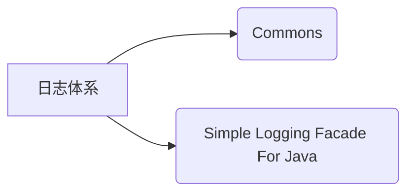

# log

日志可以用来记录程序运行过程的信息。

为什么不输出在控制台呢？
因为该信息只能出现在控制台，并且无法永久保存，只能通过修改代码的方式来修改信息。

## 输出语句与日志技术的区别

|    | 输出语句 | 日志技术 |
| :--: | :--: | :--: |
| 输出位置 | 只能是控制台 | 文件或数据库中 |
| 取消日志 | 需要修改代码 | 不需要修改代码 |
| 多线程   | 性能较差   | 性能较好  |

## 日志体系结构



## logback.xml

```java
<?xml version="1.0" encoding="UTF-8"?>
<configuration>
    <!--
        CONSOLE ：表示当前的日志信息是可以输出到控制台的。
    -->
    <appender name="CONSOLE" class="ch.qos.logback.core.ConsoleAppender">
        <!--输出流对象 默认 System.out 改为 System.err-->
        <target>System.out</target>
        <encoder>
            <!--格式化输出：%d表示日期，%thread表示线程名，%-5level：级别从左显示5个字符宽度
                %msg：日志消息，%n是换行符-->
            <pattern>%d{yyyy-MM-dd HH:mm:ss.SSS} [%-5level]  %c [%thread] : %msg%n</pattern>
        </encoder>
    </appender>

    <!-- File是输出的方向通向文件的 -->
    <appender name="FILE" class="ch.qos.logback.core.rolling.RollingFileAppender">
        <encoder>
            <pattern>%d{yyyy-MM-dd HH:mm:ss.SSS} [%thread] %-5level %logger{36} - %msg%n</pattern>
            <charset>utf-8</charset>
        </encoder>
        <!--日志输出路径-->
        <file>/Users/jam/Documents/logback/logback.log</file>
        <!--指定日志文件拆分和压缩规则-->
        <rollingPolicy
                class="ch.qos.logback.core.rolling.SizeAndTimeBasedRollingPolicy">
            <!--通过指定压缩文件名称，来确定分割文件方式-->
            <fileNamePattern>/Users/jam/Documents/logback/jam-data2-%d{yyyy-MMdd}.log%i.gz</fileNamePattern>
            <!--文件拆分大小-->
            <maxFileSize>1MB</maxFileSize>
        </rollingPolicy>
    </appender>

    <!--

    level:用来设置打印级别，大小写无关：TRACE, DEBUG, INFO, WARN, ERROR, ALL 和 OFF
   ， 默认debug
    <root>可以包含零个或多个<appender-ref>元素，标识这个输出位置将会被本日志级别控制。
    -->
    <root level="ALL">
        <!--注意:如果这里不配置关联打印位置，该位置将不会记录日志-->
        <appender-ref ref="CONSOLE"/>
        <appender-ref ref="FILE" />
    </root>
</configuration>
```


### 输出位置

在`<appender>`标签中的`<file>`标签是配置日志输出路径的，使用绝对路径。

### 格式设置

在`<encoder>`中的`<pattern>`标签中使用如`%d{yyyy-MM-dd HH:mm:ss.SSS} [%thread] %-5level %logger{36} - %msg%n`的样式用来格式化日志；

在`<fileNamePattern>`使用绝对路径+格式化名称来命名压缩文件名称。

### 日志等级

在`<root>`标签中的`level`属性用来设置打印级别，大小写无关：TRACE, DEBUG, INFO, WARN, ERROR, ALL 和 OFF，默认debug
