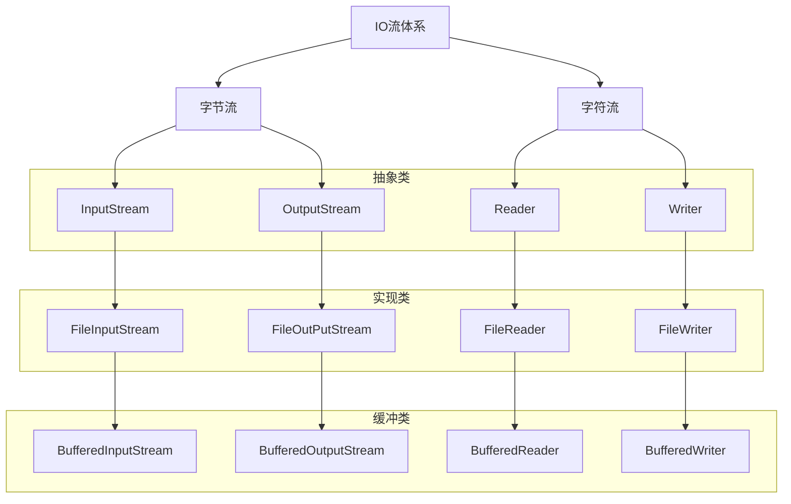

# 优化IO流




## 缓冲流

缓冲流自带缓冲区，可以提高原始字节流、字符流读写数据性能

### 字节缓冲流

字节缓冲流自带8kb缓冲区，当程序读写时通过读写储存在内存中的缓冲区来提高读写速度。

```java
File f = new File("/Users/jam/IdeaProjects/java/src/斗破苍穹utf8.txt");
File f2 = new File("/Users/jam/IdeaProjects/java/dy10/src/1.txt");
InputStream bis = new BufferedInputStream(new FileInputStream(f));
OutputStream bos = new BufferedOutputStream(new FileOutputStream(f2, true))
```

#### 性能分析

```java
File f = new File("/Users/jam/IdeaProjects/java/src/斗破苍穹utf8.txt");
File f1 = new File("/Users/jam/IdeaProjects/java/dy10/src/1.txt");
File f2 = new File("/Users/jam/IdeaProjects/java/dy10/src/2.txt");
File f3 = new File("/Users/jam/IdeaProjects/java/dy10/src/3.txt");
File f4 = new File("/Users/jam/IdeaProjects/java/dy10/src/4.txt");

// 使用低级的字节流 一个一个字节复制文件 , 慢死了，丨！
//    copy1(f, f1);
// 使用低级字节流 一组一组字节复制文件
copy2(f,f2);
// 使用缓冲流一个一个字节copy
copy3(f,f3);
// 使用缓冲流 一组一组copy
copy4(f,f4);
/*$Out: 
使用低级的字节流 一组一子复制文件:0.182s
使用缓冲流一个一个字节copy:0.221s
使用缓冲流 一组一组copy:0.149s
*/
```

### 字符缓冲流


## 转换流

## 序列化对象

## 打印流

## Properties

## IO框架
