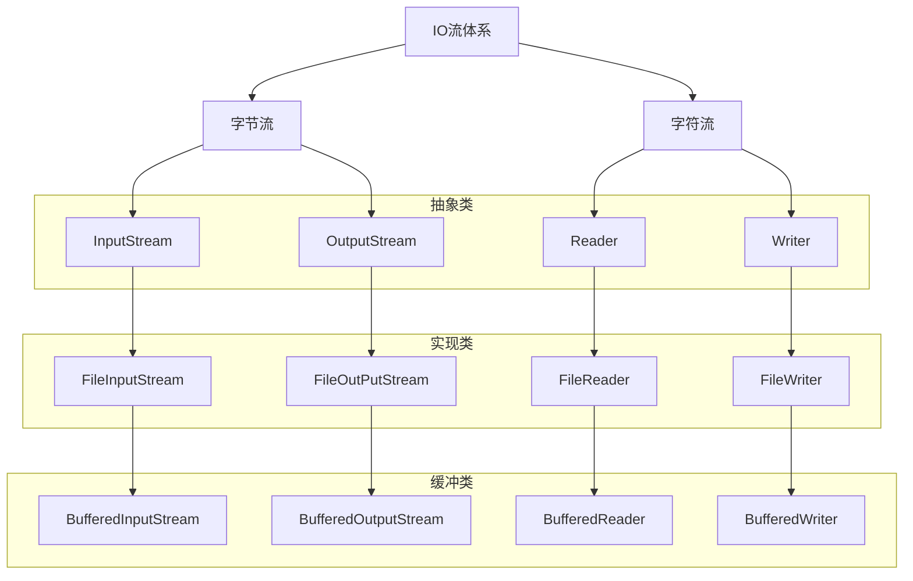
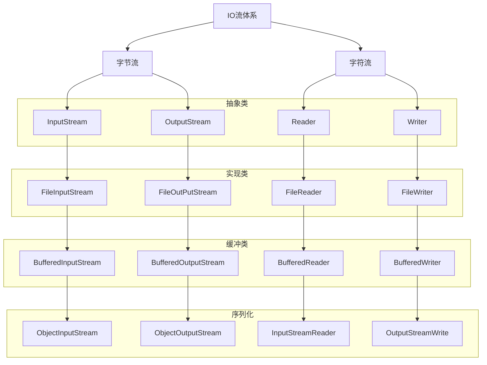
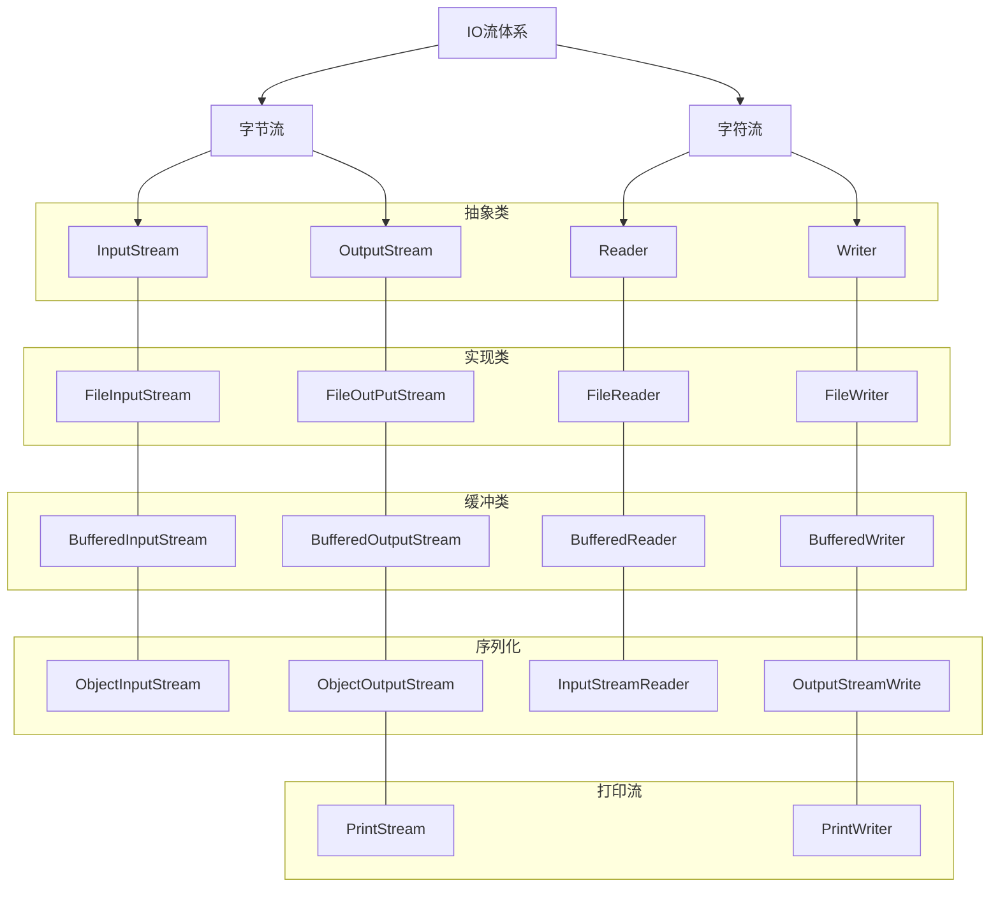

# 优化IO流




## 缓冲流

缓冲流自带缓冲区，可以提高原始字节流、字符流读写数据性能

### 字节缓冲流

字节缓冲流自带8kb缓冲区，当程序读写时通过读写储存在内存中的缓冲区来提高读写速度。

```java
File f = new File("/Users/jam/IdeaProjects/java/src/斗破苍穹utf8.txt");
File f2 = new File("/Users/jam/IdeaProjects/java/dy10/src/1.txt");
InputStream bis = new BufferedInputStream(new FileInputStream(f));
OutputStream bos = new BufferedOutputStream(new FileOutputStream(f2, true))
```

#### 性能分析

```java
File f = new File("/Users/jam/IdeaProjects/java/src/斗破苍穹utf8.txt");
File f1 = new File("/Users/jam/IdeaProjects/java/dy10/src/1.txt");
File f2 = new File("/Users/jam/IdeaProjects/java/dy10/src/2.txt");
File f3 = new File("/Users/jam/IdeaProjects/java/dy10/src/3.txt");
File f4 = new File("/Users/jam/IdeaProjects/java/dy10/src/4.txt");

// 使用低级的字节流 一个一个字节复制文件 , 慢死了，丨！
//    copy1(f, f1);
// 使用低级字节流 一组一组字节复制文件
copy2(f,f2);
// 使用缓冲流一个一个字节copy
copy3(f,f3);
// 使用缓冲流 一组一组copy
copy4(f,f4);
/*$Out: 
使用低级的字节流 一组一子复制文件:0.182s
使用缓冲流一个一个字节copy:0.221s
使用缓冲流 一组一组copy:0.149s
*/
```

### 字符缓冲流


## 转换流

```java
// "UTF-8"代表输入文本使用字符集
InputStreamReader isr = new InputStreamReader(new FileInputStream(f), "UTF-8");
// "GBK"代表输出文本使用字符集
OutputStreamWriter osw = new OutputStreamWriter(new FileOutputStream(f1), "GBK");
```

使用案例：

```java
try (
    InputStreamReader isr = new InputStreamReader(
        new FileInputStream("/Users/jam/IdeaProjects/java/src/斗破苍穹utf8.txt"), "UTF-8");
    OutputStreamWriter osw = new OutputStreamWriter(
        new FileOutputStream("/Users/jam/IdeaProjects/java/dy10/src/doupo-GBK.txt"), "GBK"
    );
) {
  BufferedReader br = new BufferedReader(isr);
  BufferedWriter bw = new BufferedWriter(osw);

  String s;
  while ((s = br.readLine()) != null) {
    bw.write(s);
    bw.newLine();
  }

} catch (Exception e) {
  e.printStackTrace();
}
```

## 序列化对象


序列化是指将程序执行时创建的对象存储在磁盘中，以便下次使用。

**注意**：只有实现了`java.io.Serializable`接口的类才能被序列化。

```java
// 创建对象
Student s = new Student("yiyi", "loging1", "123123", 18);
// 保存对象至磁盘
// 对象序列化
ObjectOutputStream oos = new ObjectOutputStream(
  new FileOutputStream("/Users/jam/IdeaProjects/java/dy10/src/obj.txt"));

// 使用序列化方法
oos.writeObject(s);

// 释放资源
oos.close();
```

### 反序列化

使用存储在磁盘中的对象。

```java
try {
  ObjectInputStream ois = new ObjectInputStream(
    new FileInputStream("/Users/jam/IdeaProjects/java/dy10/src/obj.txt"));
  Student s = (Student) ois.readObject();
  System.out.println(s);
  ois.close();
} catch (Exception e) {
  e.printStackTrace();
}
```

### 选择性存储

当需要储存敏感信息而且不希望该信息被储存在磁盘时，可以使用`transient`修饰成员变量，比如修饰账户密码、身份证号码等。

```java
public class Student implements Serializable {
  private String name;
  private String loginName;
  // 该类中的password在被序列化时不会储存在磁盘中
  private transient String password;
  private int age;
}
```

### 版本更新

当存储类需要修改成员变量时，可以通过设置`serialVersionUID`来控制版本号，进行类版本的数据隔离，防止因为修改类时导致的数据不兼容。

```java
public class Student implements Serializable {
  // 只有存储对象的版本号与解包对象的版本号相同时才能被正常使用
  private static final long serialVersionUID = 2;
  private String name;
  private String loginName;
  private transient String password;
  private int age;
}
```

## 打印流



打印流基于`Buffered`缓冲流实现**高效**，使用`String.valueOf()`将所有传入的值或对象转换成字符串并写入文件实现**方便**。

## Properties

```java
Properties p = new Properties();
p.setProperty("admin", "123123");
p.setProperty("admin2", "123123");
p.setProperty("admin3", "123123");
System.out.println(p);

p.store(new FileWriter("dy10/src/users.properties")
  , "add users");
```

```java
Properties p = new Properties();
System.out.println(p);

p.load(new FileReader("dy10/src/users.properties"));
System.out.println(p);
System.out.println(p.getProperty("admin"));
System.out.println(p.getProperty("admin1"));
System.out.println(p.getProperty("admin2"));
System.out.println(p.getProperty("admin3"));
System.out.println(p.stringPropertyNames());
```

## IO框架

apache提供的IO框架：[commons-io](https://commons.apache.org/proper/commons-io/)

导入即可使用