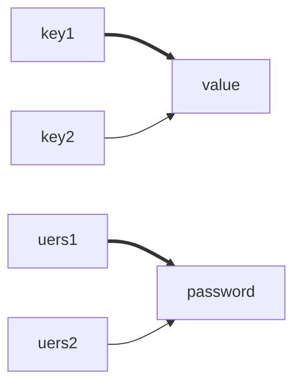
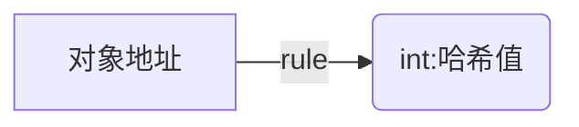

# 集合

存储对象数据的一种容器。


## 特点

- 大小不定，自适应大小，只要是对象就可以放；
- 适用于元素的增删。

如果要存基本类型时，使用包装类进行存储。

## 集合与数组的区别

- 数组存储类型确定、大小固定，集合存储类型不固定、大小可变；
- 数组可以存储基本类型和引用类型数据，集合只能存储引用类型的数据；
- 数组适用于数据大小类型确定的场景，集合使用与大小类型不确定<span style="color:red;">且</span>需要做增删操作的场景。

## Collection

抽象子类：

- List：元素有序、可重复、有索引，子类ArrayList、LinkedList；
- Set：元素无序、不重复、无索引，子类HashSet、LinkedHashSet（**有序**）、TreeSet（**按照大小默认升序**）。

类比数学：List 是**数学中数组**的一个子类，Set 是**数学中集合**的一个子类。

### ArrayList API

#### remove
```java
public boolean remove(Object o) {
    // 非空检验，为空则查找整个集合中的所有空项并清理空间
    if (o == null) {
        for (int index = 0; index < size; index++)
            if (elementData[index] == null) {
                fastRemove(index);
                return true;
            }
    } else {
        for (int index = 0; index < size; index++)
            if (o.equals(elementData[index])) {
                fastRemove(index);
                return true;
            }
    }
    return false;
}
```

#### add

```java
public boolean add(E e) {
    // 确认内存空间
    ensureCapacityInternal(size + 1);  
    // 添加该对象
    elementData[size++] = e;
    return true;
}
```

#### addAll

```java
public boolean addAll(Collection<? extends E> c) {
    // 将添加集合转换为对象
    Object[] a = c.toArray();
    int numNew = a.length;
    // 确认内存空间
    ensureCapacityInternal(size + numNew);  // 将要添加的集合放置在该集合之后
    System.arraycopy(a, 0, elementData, size, numNew);
    size += numNew;
    return numNew != 0;
}
```

#### clear

```java
public void clear() {
    modCount++;

    // 清空数据
    for (int i = 0; i < size; i++)
        elementData[i] = null;
    // 设置空间大小
    size = 0;
}

```

### 几种遍历元素的方法

#### 迭代器
```java
Iterator<Integer> I = list.iterator();
while (I.hasNext()) System.out.println(I.next());
```

#### for
```java
for (int i = 0; i < lists.size(); i++) {
    System.Out.println(lists.get(i));
}
```

#### foreach
```java
for (Integer i: list) System.out.println(i);
```

#### lambda

```java
list.forEach(new Consumer<Integer>() {
    @Override
    public void accept(Integer integer) {
        System.out.println(integer);
    }
});
```

化简：
```java
list.forEach(s -> System.Out.println(integer))
```


forEach源码：
```java
default void forEach(Consumer<? super T> action) {
    Objects.requireNonNull(action);
    for (T t : this) {
        action.accept(t);
    }
}
```
更简洁书写：
```java
list.forEach(System.out::println);
```

### 堆栈原理


### 删除元素注意事项

#### 迭代器

```java
while (it.hasNext()) {
    if ("4".equals(it.next())) {
        it.remove();
    }
}
```

#### lambda & 增强for

均会导致并发修改错误，因为都无法控制游标。

#### for 

正向遍历：
```java
for (int i = 0; i < list.size(); i++) {
    if ("4".equals(list.get(i))) {
        list.remove(i);
        i--;
    }
}
```

方向遍历：
```java
for (int i = list.size() - 1; i >= 0; i--) {
    if ("4".equals(list.get(i))) {
        list.remove(i);
    }
}

```

## Set



多个键可以有同一个值。
<span style="color:red;">**多个用户可以拥有相同的密码。**
</span>单个键不能同时有多个值。
<span style="color:red;">**单个用户不可以有多个密码。**</span>

- 无序：存取顺序不一致
- 不重复：自动去重复
- 无索引：没有没有

在JDK8之前，哈希表使用<span style="color:red">数组+链表</span>组成
在JDK8之后，哈希表使用<span style="color:red">数组+链表+红黑树</span>组成


### HashSet

无序、不重复、无索引。


### LinkedHashSet

有序、不重复、无索引。
使用哈希表+双链表实现。

### TreeSet

**排序**、不重复、无索引。

#### 类实现compareTo制定排序规则

```java
@Override
public int compareTo(Student o) {
    return this.age - o.getAge() >= 0 ? 1 : -1;
}
```

#### 类构造器制定排序规则

```java
Set<Student> sets = new TreeSet<>(
    (o1, o2) -> 
    o1.getAge() >= o2.getAge() ? 1 : -1);

```

### 哈希值




### 为什么重写equals时同时需要重写hashCode方法？

当使用Set存储自定义类对象时，因为new出来的每一个对象都有不同地址，无法通过Set自带的equals去判断对象是否相同而导致无法去重，所以需要重写

因为Set类在存储值时会先通过计算该对象的哈希值（hashCode）来选择存储位置，如果该存储位置有元素则会通过比较该元素与存储元素是否相同（equals）来确定是否为同一个元素。
如果只重写equals而不同时重写hashCode的话，可能会出现同一位置重现相同对象而导致哈希冲突，造从不必要的错误。

### Map集合遍历

#### 键找值

```java
Set<String> strings = maps.keySet();
for (String key :
        strings) {
    System.out.println(maps.get(key).getName());
}
```

#### 键值对

```java
for (Map.Entry<String, Student> entry : maps.entrySet()) {
    System.out.println(entry.getValue());
}
```

#### lambda表达式

```java
maps.forEach((s, student) -> System.out.println(student.getName()));
```
