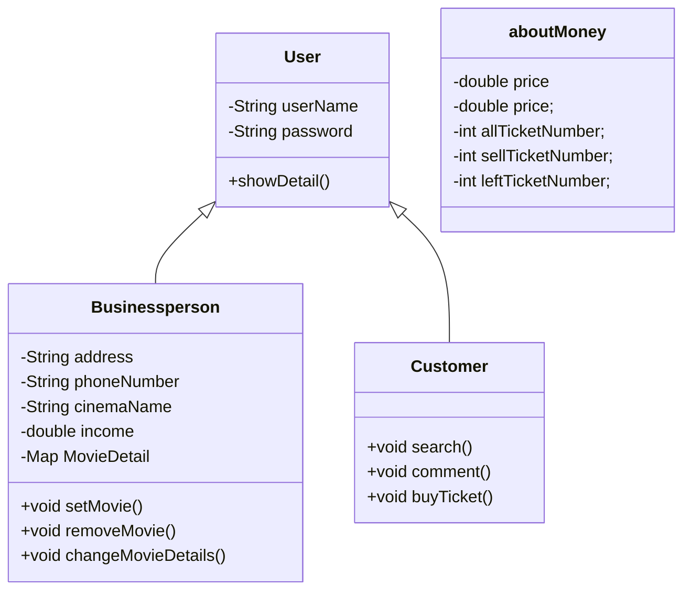
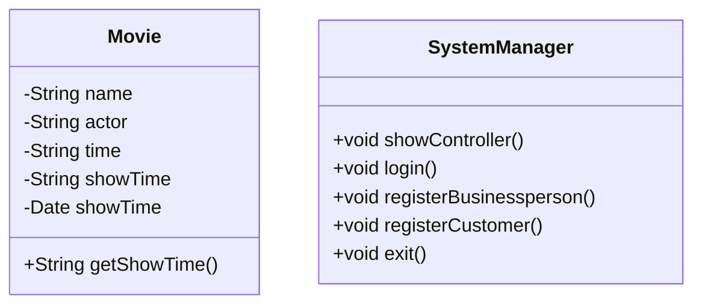

# class

```mermaid
classDiagram
    User <|-- Businessperson
    User <|-- Customer
    User : -String userName
    User : -String password
    User : +showDetail()
    class Businessperson{
        -String address
        -String phoneNumber
        -String cinemaName
        -double income
        -Map MovieDetail
        +void setMovie()
        +void removeMovie()
        +void changeMovieDetails()

    }
    class aboutMoney{
        -double price
        -double price;
        -int allTicketNumber;
        -int sellTicketNumber;
        -int leftTicketNumber;
    }
    
    class Customer{
        +void search()
        +void comment()
        +void buyTicket()
    }
```

```mermaid
classDiagram
    class Movie{
        -String name
        -String actor
        -String time
        -String showTime
        -Date showTime
        +String getShowTime()
    }
    class SystemManager{
        +void showController()
        +void login()
        +void registerBusinessperson()
        +void registerCustomer()
        +void exit()
    }
```

